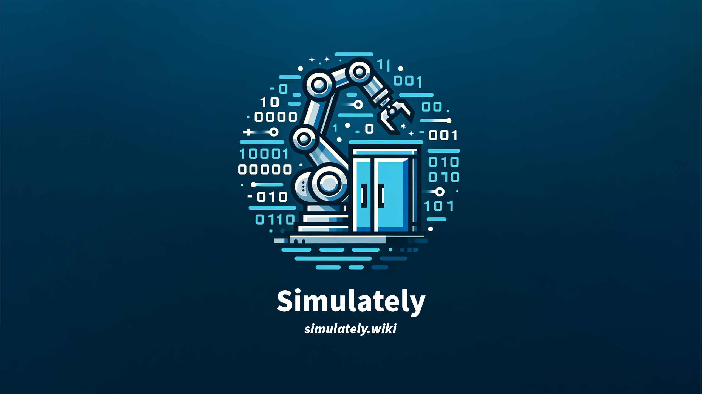

# Simulately

[Simulately](https://simulately.wiki) is a website where we gather useful information of **physics simulator** for cutting-edge robot learning research. It is still under active development, so stay tuned!

> The website is built with Docusaurus, powered by Cloudflare Pages.

## Contributors ✨

**Simualtely** is started by [Haoran Geng](https://geng-haoran.github.io/), [Yuyang Li](https://yuyangli.com/), [Ran Gong](https://nikepupu.github.io/), [Yuanpei Chen](https://cypypccpy.github.io/), [Wensi Ai](https://wensi-ai.github.io), [Puhao Li](https://xiaoyao-li.github.io/), [Yuzhe Qin](https://yzqin.github.io/), [Songlin Wei](http://wei.songl.in/), [Xian Zhou](https://www.zhou-xian.com/).

Thanks goes to these wonderful people:
<!-- ALL-CONTRIBUTORS-BADGE:START - Do not remove or modify this section -->

<!-- ALL-CONTRIBUTORS-BADGE:END -->

<!-- ALL-CONTRIBUTORS-LIST:START - Do not remove or modify this section -->
<!-- prettier-ignore-start -->
<!-- markdownlint-disable -->
<table>
  <tbody>
    <tr>
      <td align="center" valign="top" width="14.28%"><a href="https://geng-haoran.github.io/"> <b>Haoran Geng</b></a> <a href="#example-geng-haoran" title="Examples">💡</a> <a href="https://github.com/geng-haoran/Simulately/commits?author=geng-haoran" title="Code">💻</a> <a href="https://github.com/geng-haoran/Simulately/commits?author=geng-haoran" title="Documentation">📖</a> <a href="#content-geng-haoran" title="Content">🖋</a> <a href="#blog-geng-haoran" title="Blogposts">📝</a></td>
      <td align="center" valign="top" width="14.28%"><a href="https://yuyangli.com/"> <b>Yuyang Li</b></a> <a href="#example-YuyangLee" title="Examples">💡</a> <a href="https://github.com/geng-haoran/Simulately/commits?author=YuyangLee" title="Code">💻</a> <a href="https://github.com/geng-haoran/Simulately/commits?author=YuyangLee" title="Documentation">📖</a> <a href="#content-YuyangLee" title="Content">🖋</a> <a href="#blog-YuyangLee" title="Blogposts">📝</a></td>
      <td align="center" valign="top" width="14.28%"><a href="https://github.com/yzqin"> <b>Yuzhe Qin</b></a> <a href="https://github.com/geng-haoran/Simulately/commits?author=yzqin" title="Documentation">📖</a> <a href="#content-yzqin" title="Content">🖋</a> <a href="#blog-yzqin" title="Blogposts">📝</a></td>
      <td align="center" valign="top" width="14.28%"><a href="https://github.com/nikepupu"> <b>nikepupu</b></a> <a href="https://github.com/geng-haoran/Simulately/commits?author=nikepupu" title="Documentation">📖</a> <a href="#content-nikepupu" title="Content">🖋</a> <a href="https://github.com/geng-haoran/Simulately/commits?author=nikepupu" title="Code">💻</a></td>
      <td align="center" valign="top" width="14.28%"><a href="https://github.com/wensi-ai"> <b>Wensi (Vince) Ai</b></a> <a href="https://github.com/geng-haoran/Simulately/commits?author=wensi-ai" title="Documentation">📖</a> <a href="#content-wensi-ai" title="Content">🖋</a></td>
      <td align="center" valign="top" width="14.28%"><a href="https://cypypccpy.github.io/"> <b>cypypccpy</b></a> <a href="https://github.com/geng-haoran/Simulately/commits?author=cypypccpy" title="Documentation">📖</a> <a href="#content-cypypccpy" title="Content">🖋</a> <a href="https://github.com/geng-haoran/Simulately/commits?author=cypypccpy" title="Code">💻</a></td>
      <td align="center" valign="top" width="14.28%"><a href="https://www.zhou-xian.com/"> <b>Zhou Xian</b></a> <a href="https://github.com/geng-haoran/Simulately/commits?author=zhouxian" title="Documentation">📖</a> <a href="#content-zhouxian" title="Content">🖋</a> <a href="https://github.com/geng-haoran/Simulately/commits?author=zhouxian" title="Code">💻</a></td>
    </tr>
    <tr>
      <td align="center" valign="top" width="14.28%"><a href="https://xiaoyao-li.github.io/"> <b>Puhao Li</b></a> <a href="https://github.com/geng-haoran/Simulately/commits?author=Xiaoyao-Li" title="Documentation">📖</a> <a href="#content-Xiaoyao-Li" title="Content">🖋</a> <a href="https://github.com/geng-haoran/Simulately/commits?author=Xiaoyao-Li" title="Code">💻</a></td>
      <td align="center" valign="top" width="14.28%"><a href="https://github.com/DaLi-Jack"> <b>Junfeng Ni</b></a> <a href="https://github.com/geng-haoran/Simulately/commits?author=DaLi-Jack" title="Documentation">📖</a> <a href="#content-DaLi-Jack" title="Content">🖋</a></td>
      <td align="center" valign="top" width="14.28%"><a href="https://github.com/Benjamin-eecs"> <b>Bo Liu</b></a> <a href="https://github.com/geng-haoran/Simulately/commits?author=Benjamin-eecs" title="Documentation">📖</a> <a href="#content-Benjamin-eecs" title="Content">🖋</a></td>
      <td align="center" valign="top" width="14.28%"><a href="https://github.com/qq456cvb"> <b>Yang You</b></a> <a href="https://github.com/geng-haoran/Simulately/commits?author=qq456cvb" title="Documentation">📖</a> <a href="#content-qq456cvb" title="Content">🖋</a></td>
      <td align="center" valign="top" width="14.28%"><a href="https://github.com/Selina2023"> <b>Yufei Ding</b></a> <a href="https://github.com/geng-haoran/Simulately/commits?author=Selina2023" title="Documentation">📖</a> <a href="#content-Selina2023" title="Content">🖋</a></td>
      <td align="center" valign="top" width="14.28%"><a href="https://github.com/songlin"> <b>Wei Songlin</b></a> <a href="https://github.com/geng-haoran/Simulately/commits?author=songlin" title="Documentation">📖</a> <a href="#content-songlin" title="Content">🖋</a></td>
    </tr>
  </tbody>
  <tfoot>
    <tr>
      <td align="center" size="13px" colspan="7">
        
          <a href="https://all-contributors.js.org/docs/en/bot/usage">Add your contributions</a>
        </img>
      </td>
    </tr>
  </tfoot>
</table>

<!-- markdownlint-restore -->
<!-- prettier-ignore-end -->

<!-- ALL-CONTRIBUTORS-LIST:END -->

<!-- example,code,doc,content,blog  -->

This project follows the [all-contributors](https://github.com/all-contributors/all-contributors) specification. Contributions of any kind welcome!