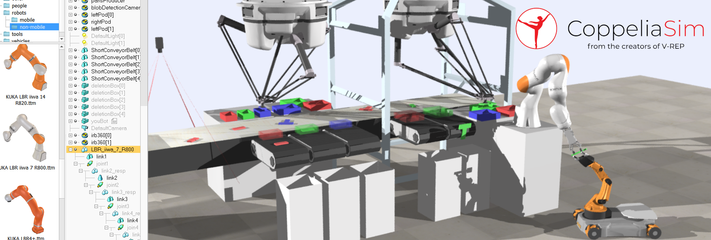

<h2 align="center">
  <b>CoppeliaSim (formerly V-REP): a Versatile and Scalable Robot Simulation Framework</b>

    <a href="https://www.coppeliarobotics.com/" target="_blank"></img></a>
    &nbsp;
    <a href="https://www.coppeliarobotics.com/helpFiles/index.html" target="_blank"></img></a>
    &nbsp;
    <a href="https://ieeexplore.ieee.org/document/6696520" target="_blank"></img></a>
    &nbsp;
    <a href="https://github.com/CoppeliaRobotics/CoppeliaSimLib" target="_blank"></img></a>

</h2>

> The robotics simulator CoppeliaSim (formerly V-REP), with integrated development environment, is based on a distributed control architecture: each object/model can be individually controlled via an embedded script, a plugin, a ROS node, a remote API client, or a custom solution. This makes CoppeliaSim very versatile and ideal for multi-robot applications. Controllers can be written in C/C++, Python, Java, Lua, Matlab or Octave. CoppeliaSim is used for fast algorithm development, factory automation simulations, fast prototyping and verification, robotics related education, remote monitoring, safety double-checking, as digital twin, and much more.

## Official Materials
- [Website](https://www.coppeliarobotics.com/)
- [Document](https://www.coppeliarobotics.com/helpFiles/index.html)
- [Paper](https://ieeexplore.ieee.org/document/6696520)
- [Source Code](https://github.com/CoppeliaRobotics/CoppeliaSimLib)

## Related Materials
- [Tutorials](https://www.coppeliarobotics.com/helpFiles/en/tutorials.htm)

## Related Projects
- CoRL2022: [Perceiver-Actor: A Multi-Task Transformer for Robotic Manipulation](https://peract.github.io/)
- Neurips 2022: [VLMbench:  A Compositional Benchmark for Vision-and-Language Manipulation](https://sites.google.com/ucsc.edu/vlmbench/home)
- CVPR 2022: [Coarse-to-Fine Q-attention: Efficient Learning for Visual Robotic Manipulation via Discretisation](https://sites.google.com/view/c2f-q-attention)
- RAL 2022: [Q-attention: Enabling efficient learning for vision-based robotic manipulation](https://sites.google.com/view/q-attention)
- RAL2020: [RLBench: The Robot Learning Benchmark & Learning Environment](https://sites.google.com/view/rlbench)
- Arxiv 2019: [PyRep: Bringing V-REP to Deep Robot Learning](https://github.com/stepjam/PyRep)