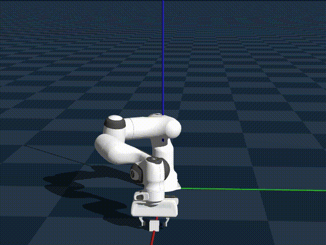

<!-- title -->
<h2 align="center">
  <b>Genesis</b>

    <a href="https://genesis-embodied-ai.github.io/" target="_blank">
      
      </img>
    </a>
    &nbsp;
    <a href="" target="_blank">
        </img></a>
    &nbsp;
    <a href="https://github.com/Genesis-Embodied-AI/Genesis" target="_blank"></img></a>

</h2>

 

> Genesis integrates various physics solvers and their coupling into a unified framework. This core physics engine is further enhanced by a generative agent framework that operates at an upper level, aiming towards fully automated data generation for robotics and beyond.

## Official Materials
- [Website](https://genesis-embodied-ai.github.io/)
- Genesis Paper - coming soon
- [Genesis Document](https://genesis-world.readthedocs.io/en/latest/index.html)
- [Genesis Github](https://github.com/Genesis-Embodied-AI/Genesis) 

## Related Benchmarks 

### Performance Report
This document contains a detailed report on Genesis's performance (FPS), comparatively analyzed alongside other GPU-accelerated robotics simulators (Mujoco, IsaacGym, Maniskill) through a series of tests involving but not limited to static and dynamic scenes, self-collisions, continuous collisions, and object manipulation/grasping.

The document concludes that Genesis performs fast on both per-environment settings and parallel environment settings, with a total FPS scaling linearly with number of parallel environments up to over 32768 envs.

*Testing shows Genesis performs up to 8.8x faster than Maniskill in grasping-with-path-following scenario (gripper asked to follow simple motion trajectory)*

- [See detailed report](https://placid-walkover-0cc.notion.site/genesis-performance-benchmarking#1700c06194e180fca2a5e884def86add)
- [Link to testing scripts](https://github.com/zhouxian/genesis-speed-benchmark)

## Related Projects
- [ICLR 2024] [DiffTactile: A Physics-based Differentiable Tactile Simulator for Contact-rich Robotic Manipulation](https://github.com/Genesis-Embodied-AI/DiffTactile)
- [Towards Generalist Robots: A Promising Paradigm via Generative Simulation](https://arxiv.org/abs/2305.10455)