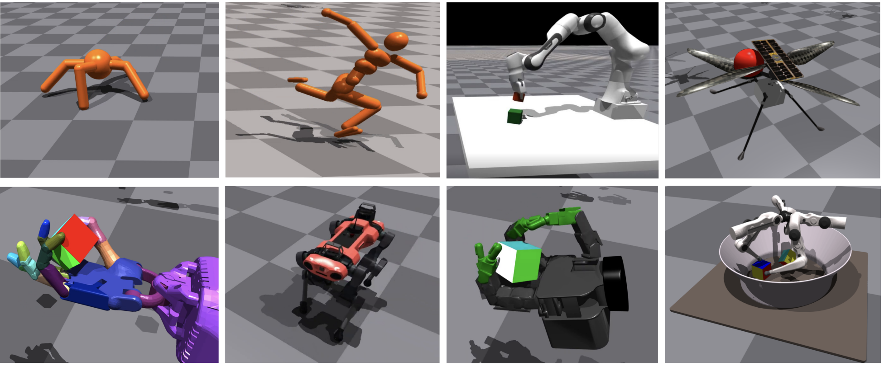

<h2 align="center">
  <b>Isaac Gym: High Performance GPU-Based Physics Simulation For Robot Learning</b>

    <a href="https://developer.nvidia.com/isaac-gym" target="_blank"></img></a>
    &nbsp;
    <a href="https://arxiv.org/abs/2108.10470" target="_blank"></img></a>
    &nbsp;
    <a href="https://forums.developer.nvidia.com/c/agx-autonomous-machines/isaac/isaac-gym/322" target="_blank"></img></a>

</h2>

> NVIDIA’s physics simulation environment for reinforcement learning research.

## Official Materials
- [Website](https://developer.nvidia.com/isaac-gym)
- [Paper](https://arxiv.org/abs/2108.10470)
- [Forum](https://forums.developer.nvidia.com/c/agx-autonomous-machines/isaac/isaac-gym/322)
- [OmniIsaacGymEnvs](https://github.com/NVIDIA-Omniverse/OmniIsaacGymEnvs)

## Related Materials
- [Awesome NVIDIA Isaac Gym](https://github.com/wangcongrobot/awesome-isaac-gym)

## Related Benchmark

### Bi-DexHands
Bi-DexHands provides a collection of bimanual dexterous manipulations tasks and reinforcement learning algorithms. Reaching human-level sophistication of hand dexterity and bimanual coordination remains an open challenge for modern robotics researchers. To better help the community study this problem, Bi-DexHands are developed with the following key features:
  
  - [Website](https://bi-dexhands.ai)
  - [Code](https://github.com/PKU-MARL/DexterousHands)
  - [Paper](https://arxiv.org/abs/2206.08686)

## Related Projects
- ICCV2023: [UniDexGrasp++: Improving Dexterous Grasping Policy Learning via Geometry-aware Curriculum and Iterative Generalist-Specialist Learning](https://pku-epic.github.io/UniDexGrasp++/): IsaacGym; RGB-D PointCloud
- CoRL2023: [Dynamic Handover: Throw and Catch with Bimanual Hands](https://binghao-huang.github.io/dynamic_handover/): IsaacGym; RGB
- CoRL2023: [Sequential Dexterity: Chaining Dexterous Policies for Long-Horizon Manipulation](https://sequential-dexterity.github.io/): IsaacGym; RGB-D; PointCloud
- CORL2023: [Curiosity-Driven Learning of Joint Locomotion and Manipulation Tasks](https://openreview.net/forum?id=QG_ERxtDAP-&referrer=%5Bthe%20profile%20of%20Clemens%20Schwarke%5D(%2Fprofile%3Fid%3D~Clemens_Schwarke1)): IsaacGym; RL
- CoRL2023: [General In-Hand Object Rotation with Vision and Touch](https://haozhi.io/rotateit/): IsaacGym; RGB-D
- CVPR2023: [UniDexGrasp: Universal Robotic Dexterous Grasping via Learning Diverse Proposal Generation and Goal-Conditioned Policy](https://pku-epic.github.io/UniDexGrasp/): IsaacGym; RGB-D PointCloud
- CVPR2023: [PartManip: Learning Cross-Category Generalizable Part Manipulation Policy from Point Cloud Observations](https://github.com/PKU-EPIC/PartManip): Isaac Gym; RGB-D PointCloud
- ICRA2023: [RLAfford: Official Implementation of "RLAfford: End-to-end Affordance Learning with Reinforcement Learning](https://github.com/hyperplane-lab/RLAfford): IsaacGym
- ICRA2023: [GenDexGrasp: Generalizable Dexterous Grasping](https://sites.google.com/view/gendexgrasp/): IsaacGym; RGB-D; PointCloud
- ICRA2023: [RLAfford: End-to-End Affordance Learning for Robotic Manipulation](https://sites.google.com/view/rlafford/): IsaacGym; RGB-D; PointCloud
- RSS2023: [DexPBT: Scaling up Dexterous Manipulation for Hand-Arm Systems with Population Based Training](https://sites.google.com/view/dexpbt): IsaacGym
- RSS2023: [Rotating without Seeing: Towards In-hand Dexterity through Touch](https://touchdexterity.github.io/): IsaacGym
- CoRL2022: [In-Hand Object Rotation via Rapid Motor Adaptation](https://haozhi.io/hora/): IsaacGym
- NIPS2022: [Towards Human-Level Bimanual Dexterous Manipulation with Reinforcement Learning](https://bi-dexhands.ai/): IsaacGym; RGB-D; PointCloud
- ICRA2022: [Data-Driven Operational Space Control for Adaptative and Robust Robot Manipulation](https://github.com/nvlabs/oscar): IsaacGym
- RSS2022: [Factory: Fast contact for robotic assembly](https://sites.google.com/nvidia.com/factory): IsaacGym
- SIGGRAPH2022: [ASE: Large-scale Reusable Adversarial Skill Embeddings for Physically Simulated Characters](https://nv-tlabs.github.io/ASE/): IsaacGym
- CoRL2021: [STORM: An Integrated Framework for Fast Joint-Space Model-Predictive Control for Reactive Manipulation](https://github.com/NVlabs/storm): IsaacGym
- ICRA2021: [Causal Reasoning in Simulationfor Structure and Transfer Learning of Robot Manipulation Policies](https://sites.google.com/view/crest-causal-struct-xfer-manip): IsaacGym (NoCode)
- ICRA2021: [In-Hand Object Pose Tracking via Contact Feedback and GPU-Accelerated Robotic Simulation](https://sites.google.com/view/in-hand-object-pose-tracking/): IsaacGym (NoCode)
- IROS2021: [Reactive Long Horizon Task Execution via Visual Skill and Precondition Models](https://arxiv.org/pdf/2011.08694.pdf): IsaacGym (NoCode)
- ICRA2021: [Sim-to-Real for Robotic Tactile Sensing via Physics-Based Simulation and Learned Latent Projections](https://arxiv.org/pdf/2103.16747.pdf): IsaacGym (NoCode)
- RSS2021_VLRR: [A Simple Method for Complex In-Hand Manipulation](https://sites.google.com/view/in-hand-reorientation): IsaacGym (NoCode)
- CoRL2021: [Learning to Walk in Minutes Using Massively Parallel Deep Reinforcement Learning](https://leggedrobotics.github.io/legged_gym/): IsaacGym
- ICRA2021: [Dynamics Randomization Revisited:A Case Study for Quadrupedal Locomotion](https://www.pair.toronto.edu/understanding-dr/): IsaacGym (NoCode)
- NIPS2021: [Isaac Gym: High Performance GPU-Based Physics Simulation For Robot Learning](https://sites.google.com/view/isaacgym-nvidia): IsaacGym (NoCode)
- RAL2021: [Learning a State Representation and Navigation in Cluttered and Dynamic Environments](https://arxiv.org/pdf/2103.04351.pdf): IsaacGym (NoCode)
- CoRL2020: [Learning to Compose Hierarchical Object-Centric Controllers for Robotic Manipulation](https://sites.google.com/view/compositional-object-control/): IsaacGym (NoCode)
- CoRL2020: [Learning a Contact-Adaptive Controller for Robust, Efficient Legged Locomotion](https://sites.google.com/view/learn-contact-controller/home): IsaacGym (NoCode)
- RSS2020: [Learning Active Task-Oriented Exploration Policies for Bridging the Sim-to-Real Gap](https://sites.google.com/view/task-oriented-exploration/): IsaacGym (NoCode)
- ICRA2019: [Closing the Sim-to-Real Loop: Adapting Simulation Randomization with Real World Experience](https://sites.google.com/view/simopt): IsaacGym (NoCode)
- CoRL2018: [GPU-Accelerated Robotics Simulation for Distributed Reinforcement Learning](https://sites.google.com/view/accelerated-gpu-simulation/home): IsaacGym (NoCode)
