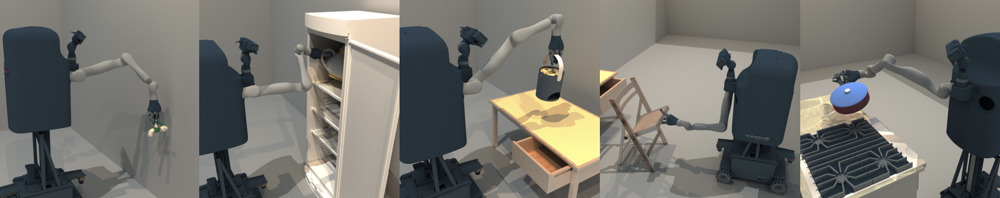
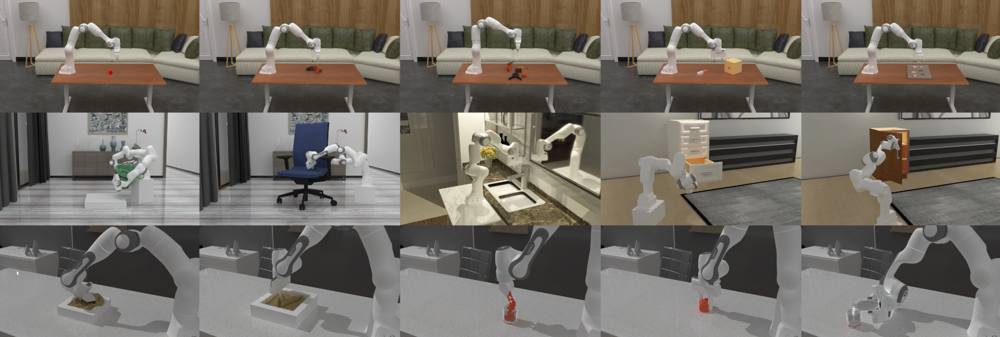

<h2 align="center">
  <b>SAPIEN: A SimulAted Part-based Interactive ENvironment</b>

    <a href="https://sapien.ucsd.edu/" target="_blank"></img></a>
    &nbsp;
    <a href="https://sapien.ucsd.edu/docs/2.0/index.html" target="_blank"></img></a>
    &nbsp;
    <a href="https://arxiv.org/abs/2003.08515" target="_blank"></img></a>
    &nbsp;
    <a href="https://github.com/haosulab/SAPIEN" target="_blank"></img></a>

</h2>

> SAPIEN simulator provides physical simulation for robots, rigidbody, and articulated objects. It powers reinforcement learning and robotics with its pure Python interface. It also provides multiple rendering modalities, including depth map, normal map, optical flow, active light, and ray tracing.

## Official Materials
- [Website](https://sapien.ucsd.edu/)
- [Document](https://sapien.ucsd.edu/docs/2.0/index.html)
- [Paper](https://arxiv.org/abs/2003.08515)
- [Source Code](https://github.com/haosulab/SAPIEN)

## Related Benchmark

### ManiSkill1&2
ManiSkill2 embraces a heterogeneous collection of out-of-the-box task families for 20 manipulation skills. Distinct types of manipulation tasks are covered: stationary/mobile-base, single/dual-arm, rigid/soft-body.
  
  - [Website](https://maniskill2.github.io/)
  - [Doc](https://haosulab.github.io/ManiSkill2/)
  - [Code](https://github.com/haosulab/ManiSkill2)
  - [Paper](https://arxiv.org/abs/2302.04659)

## Related Projects
- CVPR2023: [GAPartNet: Cross-Category Domain-Generalizable Object Perception and Manipulation via Generalizable and Actionable Parts](https://github.com/PKU-EPIC/GAPartNet): SAPIEN; RGB-D PointCloud
- IROS2022(RA-L): [Maniskill: Generalizable manipulation skill benchmark with large-scale demonstrations](https://shen-hhao.github.io/Category_Level_Manipulation/): SAPIEN; PointCloud
