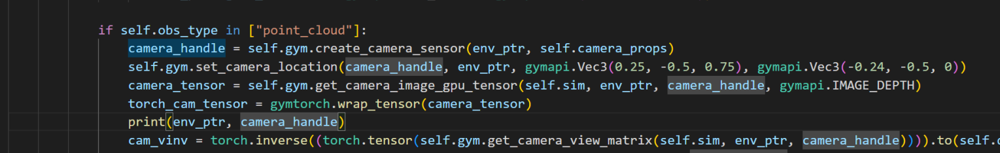

# Frequently Asked Questions

## Couldn't fine camera with handle -1 in environment 0

### Issue background

It seems like something is wrong when I try to use point cloud observation in the task.
Specifically, using the camera through isaacgym API may have some bugs. I print the 'camera_handle', whose value is -1.




### Solution
Errors that return -1 generally appear when using isaacgym on servers without a monitor. Using --headless may also cause this bug. Currently, isaacgym has many bugs with rendering, maybe you can also go to the isaacgym official [forum](https://forums.developer.nvidia.com/c/agx-autonomous-machines/isaac/isaac-gym/322) to find some answers.

## Segmentation fault (core dumped) in Docker

### Issue background

- Device NVIDIA A100 40GB PCIe GPU Accelerator

- Method: Docker

- Details:

At the end of the RL training process in Isaac Gym, it shows error in console as following.

```bash
Segmentation fault (core dumped)
```

### Solution
We can use faulthandler to locate your problem. As the docker don't haver a graphic viewer,s o we need to set the parameter "headless" as True.

## ValueError: The parameter loc has invalid values

### Issue background
I am unable to run the training in IsaacGym without getting the following error:

```bash
Traceback (most recent call last):
  File "train.py", line 95, in <module>
    train()
  File "train.py", line 47, in train
    sarl.run(num_learning_iterations=iterations, log_interval=cfg_train["learn"]["save_interval"])
  File "/media/data/users/erez/repos/bi-dexhands/main/bi-dexhands/algorithms/rl/ppo/ppo.py", line 142, in run
    actions, actions_log_prob, values, mu, sigma = self.actor_critic.act(current_obs, current_states)
  File "/media/data/users/erez/repos/bi-dexhands/main/bi-dexhands/algorithms/rl/ppo/module.py", line 77, in act
    distribution = MultivariateNormal(actions_mean, scale_tril=covariance)
  File "/home/ubuntu/miniconda3/envs/bidexhands/lib/python3.7/site-packages/torch/distributions/multivariate_normal.py", line 146, in __init__
    super(MultivariateNormal, self).__init__(batch_shape, event_shape, validate_args=validate_args)
  File "/home/ubuntu/miniconda3/envs/bidexhands/lib/python3.7/site-packages/torch/distributions/distribution.py", line 53, in __init__
    raise ValueError("The parameter {} has invalid values".format(param))
ValueError: The parameter loc has invalid values
```

No matter what I tried (various versions of python/pytorch/cuda/nvidia drivers), this error always pops-up in an undeterminitic manner (i.e. not the same iteration).

The environment I was using, that resulted with the attached traceback:
- Python 3.7
- Pytorch 1.8.1
- Torchvision 0.9.1
- CudaToolkit 11.1.1

### Solution

Yeah it's an isaacgym bug, we encountered it when we were using it. We believe that this is a bug caused by the instability of the isaacgym physics engine when dealing with collisions, so that the observations have a nan value, which leads to an error in the neural network training. Details can be found in [isaacgym devtalk forum](https://forums.developer.nvidia.com/t/actors-data-set-to-nan/180417).

Unfortunately, since this is an isaacgym issue, I don't think there is a way to fully fix this bug right now. However, I think that two methods can be taken to deal with it temporarily: 1) When the nan value appears in the obs and reward in the input of the neural network, ignore it to ensure that the training can be performed normally temporarily. 2) Referring to the [nvidia official recommendation](https://forums.developer.nvidia.com/t/actors-data-set-to-nan/180417), adjust the simulation parameters to reduce the probability of this bug. I feel that the following adjustments can reduce this bug better, you can try to see if it helps:

Open the environment parameter file and see the sim part: (such as [https://github.com/PKU-MARL/DexterousHands/blob/main/bi-dexhands/cfg/shadow_hand_push_block.yaml](https://github.com/PKU-MARL/DexterousHands/blob/main/bi-dexhands/cfg/shadow_hand_push_block.yaml))

```
sim:  
  substeps: 2 
  physx: 
    num_threads: 4 
    solver_type: 1  # 0: pgs, 1: tgs 
    num_position_iterations: 8 
    num_velocity_iterations: 0 
    contact_offset: 0.002 
    rest_offset: 0.0 
    bounce_threshold_velocity: 0.2 
    max_depenetration_velocity: 1000.0 
    default_buffer_size_multiplier: 5.0 
  flex: 
    num_outer_iterations: 5 
    num_inner_iterations: 20 
    warm_start: 0.8 
    relaxation: 0.75 
```

I found that lowering the **num_position_iterations_ parameter** helped with this, so adjusted it to below:

```
sim:
  substeps: 2
  physx:
    num_threads: 4
    solver_type: 1  # 0: pgs, 1: tgs
    num_position_iterations: 4
    num_velocity_iterations: 0
    contact_offset: 0.002
    rest_offset: 0.0
    bounce_threshold_velocity: 0.2
    max_depenetration_velocity: 1000.0
    default_buffer_size_multiplier: 5.0
  flex:
    num_outer_iterations: 5
    num_inner_iterations: 20
    warm_start: 0.8
    relaxation: 0.75
```
