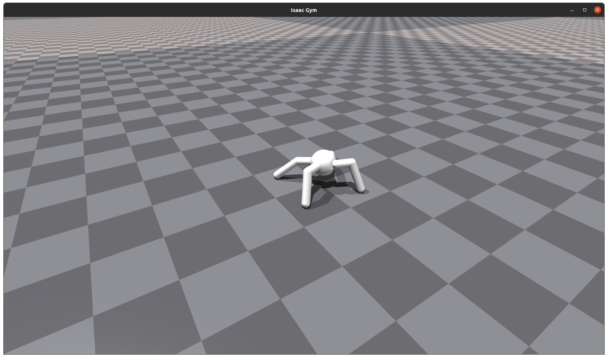
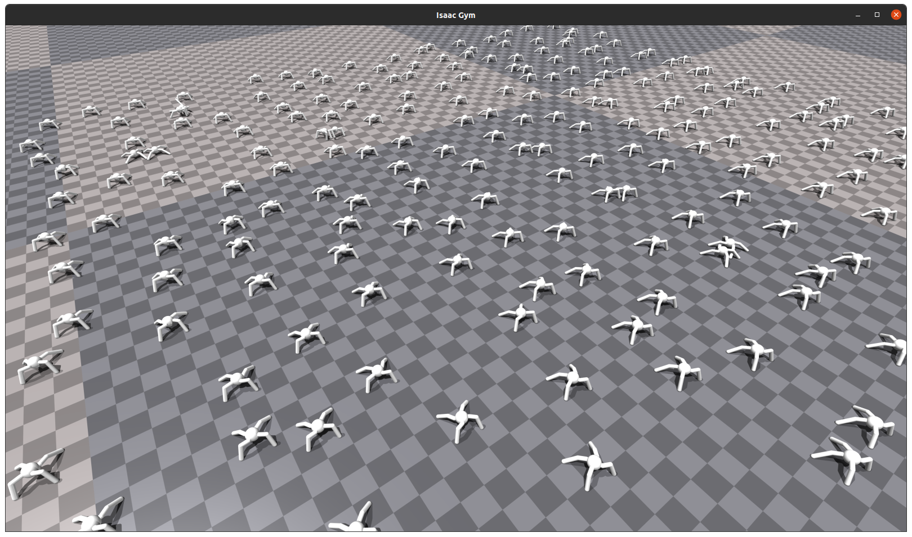
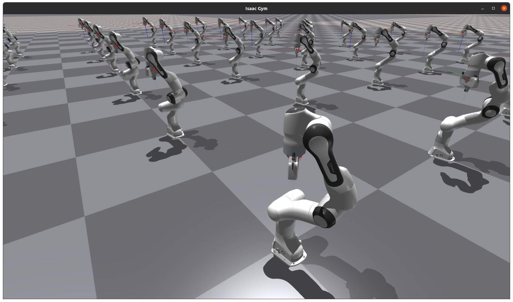

# Getting Started

Welcome to the Getting Started for using IsaacGym. In this guide, we will walk through the process of initializing the simulator, loading a groud, creating single or multiple environments and loading actors with IsaacGym API. The provided code snippets are adapted from the IsaacGym Docs to help you get started quickly.

## Initial the Simulator

### Create the GymAPI Instance

To begin, we need to acquire a singleton instance of the gym object on startup. This instance serves as a fundamental set of APIs, offering essential functions for creating and managing environments, actors, sensors, and more within the simulator.

```python
from isaacgym import gymapi, gymutil

gym = gymapi.acquire_gym()
```

### Create the Simulator
Before creating a simulator, we must specify these things:
- GPU devices we select for physics simulation and rendering.
- Physics backend (physics engine) we wish to use.
- Simulation parameters, which allow us to configure the details of physics simulation.

```python
## get default set of parameters
sim_params = gymapi.SimParams()

## set common parameters
sim_params.dt = 1 / 60
sim_params.up_axis = gymapi.UP_AXIS_Z
sim_params.gravity = gymapi.Vec3(0.0, 0.0, -9.8)

sim = gym.create_sim(compute_device_id=0, graphics_device_id=0, gymapi.SIM_PHYSX, sim_params)
```

In this example, we've configured GPU device 0 for both physics simulation and rendering, chosen PhysX as the physics engine, and tailored simulation parameters to our needs.

> **Note:** Pay attention to the up_axis and gravity parameters when creating the simulator. You can choose between Z-up and Y-up orientations, catering to different conventions in robotics and rendering research.

Distinguishing the difference between the `gym` and `sim`:
- `gym` serves as a proxy for programming script and the simulator, and does not do very much by itself.
- `sim` plays a more substantial role by housing the physics and graphics context, thereby enabling you to actively engage with and manipulate the simulator.

For more parameters of the simulator, please refers to the IsaacGym Docs.

### Create a Ground Plane (Optional)

Most simulations need a ground plane, and we can configure and create it as follows:

```python
## configure the ground plane
plane_params = gymapi.PlaneParams()
plane_params.normal = gymapi.Vec3(0, 0, 1) # z-up axis
# plane_params.normal = gymapi.Vec3(0, 1, 0) # y-up axis
plane_params.distance = 0 # specify where the ground plane be placed

## create the ground plane
gym.add_ground(sim, plane_params)
```

For more ground plane parameters, please refers to the IsaacGym Docs.


## Construct an Environment

After creating the gym and sim, let's proceed with constructing environments in IsaacGym, including creating an environment handle, loading an asset, and creating the actor from an asset.

### Create an Environment Space

Create an environment space with lower and upper bounds using create_env with the gym object.

```python
env_lower = gymapi.Vec3(-2.0, -2.0, 0.0)
env_upper = gymapi.Vec3(2.0, 2.0, 0.0)
env = gym.create_env(sim, env_lower, env_upper, 1)
```

### Load an Asset
Loading an asset file creates a `GymAsset` object that includes the definiton of all the bodies, collision shapes, visual attachments, joints, and degrees of freedom (DOFs). Soft bodies and particles are also supported with some formats.

Assume we have already placed a MJCF nvidia-ant model at `./assets/mjcf/nv_ant.xml`, which raw text can be copy from:
<details> <summary>Raw text of nv_ant.xml</summary>

```html
<mujoco model="ant">
  <custom>
    <numeric data="0.0 0.0 0.55 1.0 0.0 0.0 0.0 0.0 1.0 0.0 -1.0 0.0 -1.0 0.0 1.0" name="init_qpos"/>
  </custom>

  <default>
    <joint armature="0.01" damping="0.1" limited="true"/>
    <geom condim="3" density="5.0" friction="1.5 0.1 0.1" margin="0.01" rgba="0.97 0.38 0.06 1"/>
  </default>

  <compiler inertiafromgeom="true" angle="degree"/>

  <option timestep="0.016" iterations="50" tolerance="1e-10" solver="Newton" jacobian="dense" cone="pyramidal"/>

  <size nconmax="50" njmax="200" nstack="10000"/>
  <visual>
      <map force="0.1" zfar="30"/>
      <rgba haze="0.15 0.25 0.35 1"/>
      <quality shadowsize="2048"/>
      <global offwidth="800" offheight="800"/>
  </visual>

  <asset>
      <texture type="skybox" builtin="gradient" rgb1="0.3 0.5 0.7" rgb2="0 0 0" width="512" height="512"/>
      <texture name="texplane" type="2d" builtin="checker" rgb1=".2 .3 .4" rgb2=".1 0.15 0.2" width="512" height="512" mark="cross" markrgb=".8 .8 .8"/>
      <texture name="texgeom" type="cube" builtin="flat" mark="cross" width="127" height="1278"
          rgb1="0.8 0.6 0.4" rgb2="0.8 0.6 0.4" markrgb="1 1 1" random="0.01"/>

      <material name="matplane" reflectance="0.3" texture="texplane" texrepeat="1 1" texuniform="true"/>
      <material name="matgeom" texture="texgeom" texuniform="true" rgba="0.8 0.6 .4 1"/>
  </asset>

  <worldbody>
    <geom name="floor" pos="0 0 0" size="0 0 .25" type="plane" material="matplane" condim="3"/>

    <light directional="false" diffuse=".2 .2 .2" specular="0 0 0" pos="0 0 5" dir="0 0 -1" castshadow="false"/>
    <light mode="targetbodycom" target="torso" directional="false" diffuse=".8 .8 .8" specular="0.3 0.3 0.3" pos="0 0 4.0" dir="0 0 -1"/>

    <body name="torso" pos="0 0 0.75">
      <freejoint name="root"/>
      <geom name="torso_geom" pos="0 0 0" size="0.25" type="sphere"/>
      <geom fromto="0.0 0.0 0.0 0.2 0.2 0.0" name="aux_1_geom" size="0.08" type="capsule" rgba=".999 .2 .1 1"/>
      <geom fromto="0.0 0.0 0.0 -0.2 0.2 0.0" name="aux_2_geom" size="0.08" type="capsule"/>
      <geom fromto="0.0 0.0 0.0 -0.2 -0.2 0.0" name="aux_3_geom" size="0.08" type="capsule"/>
      <geom fromto="0.0 0.0 0.0 0.2 -0.2 0.0" name="aux_4_geom" size="0.08" type="capsule" rgba=".999 .2 .02 1"/>

      <body name="front_left_leg" pos="0.2 0.2 0">
        <joint axis="0 0 1" name="hip_1" pos="0.0 0.0 0.0" range="-40 40" type="hinge"/>
        <geom fromto="0.0 0.0 0.0 0.2 0.2 0.0" name="left_leg_geom" size="0.08" type="capsule" rgba=".999 .2 .1 1"/>
        <body pos="0.2 0.2 0" name="front_left_foot">
          <joint axis="-1 1 0" name="ankle_1" pos="0.0 0.0 0.0" range="30 100" type="hinge"/>
          <geom fromto="0.0 0.0 0.0 0.4 0.4 0.0" name="left_ankle_geom" size="0.08" type="capsule" rgba=".999 .2 .1 1"/>
        </body>
      </body>
      <body name="front_right_leg" pos="-0.2 0.2 0">
        <joint axis="0 0 1" name="hip_2" pos="0.0 0.0 0.0" range="-40 40" type="hinge"/>
        <geom fromto="0.0 0.0 0.0 -0.2 0.2 0.0" name="right_leg_geom" size="0.08" type="capsule"/>
        <body pos="-0.2 0.2 0" name="front_right_foot">
          <joint axis="1 1 0" name="ankle_2" pos="0.0 0.0 0.0" range="-100 -30" type="hinge"/>
          <geom fromto="0.0 0.0 0.0 -0.4 0.4 0.0" name="right_ankle_geom" size="0.08" type="capsule"/>
        </body>
      </body>
      <body name="left_back_leg" pos="-0.2 -0.2 0">
        <joint axis="0 0 1" name="hip_3" pos="0.0 0.0 0.0" range="-40 40" type="hinge"/>
        <geom fromto="0.0 0.0 0.0 -0.2 -0.2 0.0" name="back_leg_geom" size="0.08" type="capsule"/>
        <body pos="-0.2 -0.2 0" name="left_back_foot">
          <joint axis="-1 1 0" name="ankle_3" pos="0.0 0.0 0.0" range="-100 -30" type="hinge"/>
          <geom fromto="0.0 0.0 0.0 -0.4 -0.4 0.0" name="third_ankle_geom" size="0.08" type="capsule"/>
        </body>
      </body>
      <body name="right_back_leg" pos="0.2 -0.2 0">
        <joint axis="0 0 1" name="hip_4" pos="0.0 0.0 0.0" range="-40 40" type="hinge"/>
        <geom fromto="0.0 0.0 0.0 0.2 -0.2 0.0" name="rightback_leg_geom" size="0.08" type="capsule" rgba=".999 .2 .1 1"/>
        <body pos="0.2 -0.2 0" name="right_back_foot">
          <joint axis="1 1 0" name="ankle_4" pos="0.0 0.0 0.0" range="30 100" type="hinge"/>
          <geom fromto="0.0 0.0 0.0 0.4 -0.4 0.0" name="fourth_ankle_geom" size="0.08" type="capsule" rgba=".999 .2 .1 1"/>
        </body>
      </body>
    </body>
  </worldbody>

  <actuator>
    <motor ctrllimited="true" ctrlrange="-1.0 1.0" joint="hip_4" gear="15"/>
    <motor ctrllimited="true" ctrlrange="-1.0 1.0" joint="ankle_4" gear="15"/>
    <motor ctrllimited="true" ctrlrange="-1.0 1.0" joint="hip_1" gear="15"/>
    <motor ctrllimited="true" ctrlrange="-1.0 1.0" joint="ankle_1" gear="15"/>
    <motor ctrllimited="true" ctrlrange="-1.0 1.0" joint="hip_2" gear="15"/>
    <motor ctrllimited="true" ctrlrange="-1.0 1.0" joint="ankle_2" gear="15"/>
    <motor ctrllimited="true" ctrlrange="-1.0 1.0" joint="hip_3" gear="15"/>
    <motor ctrllimited="true" ctrlrange="-1.0 1.0" joint="ankle_3" gear="15"/>
  </actuator>
</mujoco>
```

</details>

We can load the asset from URDF and MJCF files, and configure the asset properties via `AssetOptions`.

```python
asset_root = "./assets"
asset_file = "mjcf/nv_ant.xml"
## load asset with default control type of position for all joints
asset_options = gymapi.AssetOptions()
asset_options.fix_base_link = False
ant_asset = gym.load_asset(sim, asset_root, asset_file, asset_options)
```

Gym currently supports loading [URDF](https://www.mathworks.com/help/sm/ug/urdf-model-import.html) and [MJCF](https://mujoco.readthedocs.io/en/latest/modeling.html) file formats. If you are stuck when trying to load your assets, see [IsaacGym assets limitations](https://simulately.wiki/docs/snippets/isaac-gym/limitation-asset-importer). For more imported asset properties, please refers to the IsaacGym Docs.

### Load an Actor
Note that loading an asset does not automatically add it to the simulator. A `GymAsset` serves as a blueprint for actors and can be instanced multiple times in a simulation with different poses and individualized properties. Given the blueprint of `ant_asset`, we now try to load it as an actor into the environemnt.

```python
initial_pose = gymapi.Transform()
initial_pose.p = gymapi.Vec3(0.0, 0.0, 2.0)
initial_pose.r = gymapi.Quat(0.0, 0.0, 0.0, 1.0)
ant_actor = gym.create_actor(env, ant_asset, initial_pose, 'nv_ant')
```

Distinguishing between the Robot Model (e.g., URDF and MJCF), Asset and Actor:
- `Robot Model`: A robot description file defining the multibody's forward kinematics, visual and collision properties.
- `Asset`: Derived from a Robot Model, an asset incorporates static and dynamic properties, serving as a blueprint for actors.
- `Actor`: Represents interactive objects and robots in the simulator, instantiated from an asset.

### Simulation
After setting up the environment and actors, we can start simulating.

```python
while True:
    # step the physics
    gym.simulate(sim)
    gym.fetch_results(sim, True)
```

### Rendering
For visualization, we can create a visual feedback window as a viewer for rendering what's going on in the simulation. Make sure you have attached a monitor on your machine, and set a proper graphics_device_id when create_sim.

```python
cam_props = gymapi.CameraProperties()
viewer = gym.create_viewer(sim, cam_props)

while not gym.query_viewer_has_closed(viewer):
    # step the physics
    gym.simulate(sim)
    gym.fetch_results(sim, True)

    # step the rendering of physics results
    gym.step_graphics(sim)
    gym.draw_viewer(viewer, sim, True)

    # sync_frame_time throttle down the simulation rate to real time
    gym.sync_frame_time(sim)
```

Then you will see:


See IsaacGym Docs for more details of CameraProperties.


## Construct Multiple Environments
The most important feature of IsaacGym is permiting tens of thousands of simultaneous environments on a single GPU. This is achieved by using a single simulator to manage multiple environments.

```python
import math
import random
from isaacgym import gymapi, gymutil

gym = gymapi.acquire_gym()

## get default set of parameters
sim_params = gymapi.SimParams()

## set common parameters
sim_params.dt = 1 / 60
sim_params.up_axis = gymapi.UP_AXIS_Z
sim_params.gravity = gymapi.Vec3(0.0, 0.0, -9.8)

sim = gym.create_sim(0, 0, gymapi.SIM_PHYSX, sim_params)

## configure the ground plane
plane_params = gymapi.PlaneParams()
plane_params.normal = gymapi.Vec3(0, 0, 1) # z-up axis
# plane_params.normal = gymapi.Vec3(0, 1, 0) # y-up axis
plane_params.distance = 0 # specify where the ground plane be placed

## create the ground plane
gym.add_ground(sim, plane_params)

num_envs = 256
spacing = 2.0
env_lower = gymapi.Vec3(-spacing, -spacing, 0.0)
env_upper = gymapi.Vec3(spacing, spacing, 4.0)

asset_root = "./assets"
asset_file = "mjcf/nv_ant.xml"
## load asset with default control type of position for all joints
asset_options = gymapi.AssetOptions()
asset_options.fix_base_link = False
ant_asset = gym.load_asset(sim, asset_root, asset_file, asset_options)

## create envs
for i_env in range(num_envs):
    env = gym.create_env(sim, env_lower, env_upper, int(math.sqrt(num_envs)))
    initial_pose = gymapi.Transform()
    initial_pose.p = gymapi.Vec3(random.uniform(-spacing, spacing), random.uniform(-spacing/2, spacing/2), 2.0)
    initial_pose.r = gymapi.Quat(0.0, 0.0, 0.0, 1.0)
    ant_actor = gym.create_actor(env, ant_asset, initial_pose, 'nv_ant')

cam_props = gymapi.CameraProperties()
viewer = gym.create_viewer(sim, cam_props)

while not gym.query_viewer_has_closed(viewer):
    # step the physics
    gym.simulate(sim)
    gym.fetch_results(sim, True)

    # step the rendering of physics results
    gym.step_graphics(sim)
    gym.draw_viewer(viewer, sim, True)

    # sync_frame_time throttle down the simulation rate to real time
    gym.sync_frame_time(sim)
```

Then you will see:


## Control the Actor

Controlling the robot is done using the degrees-of-freedom (DoFs). Let us consider the following two physical equations of one DoF:

<p align="center"></p>

<p align="center"></p>

, where *q*, *v*, *a* is the position, velocity and acceleration of the DoF, respectively. *dt* is the time step. The robot can be controlled by 4 ways at isaacgym in general.

- **Effort ( target *a* ) Control** involves applying a specified force or torque to the joints of the robot. This is achieved through the use of actuators, which generate forces to drive the motion of the robot. In IsaacGym, we can apply effort control to the actor using `gym.apply_dof_effort()`:
```python
props = gym.get_actor_dof_properties(env, actor)
props["driveMode"] = gymapi.DOF_MODE_EFFORT
effort = 100.0
gym.apply_dof_effort(env, dof_handle, effort)
```

- **Velocity ( target *v* ) Control** involves setting a target velocity for the DoFs of the actor. The DoFs will then move to achieve and maintain the specified velocities. In IsaacGym, you can implement velocity control using the `gym.set_dof_velocity_target()` function. Here's an example snippet:
```python
props["driveMode"] = gymapi.DOF_MODE_VEL
target_velocity = 1.0
gym.set_dof_target_velocity(env, dof_handle, target_velocity)
```

- **Position ( target *q* ) Control**: aims to reach and maintain a specific DoF position (angle for revolute joints and displacement for prismatic joints). IsaacGym provides the `gym.set_dof_target_position()` to implement it:
```python
props["driveMode"] = gymapi.DOF_MODE_POS
target_position = np.pi / 2
gym.set_dof_target_position(env, dof_handle, target_position)
```

- **Attractor ( IK to solve target *q* ) Control**: aims to reach and maintain a specific end-effector position by setting the attractor target. See official programming guide `franka_attractor.py` for more details.

<details> <summary>Official Provided Attractor Program</summary>

```python
"""
Copyright (c) 2020, NVIDIA CORPORATION. All rights reserved.

NVIDIA CORPORATION and its licensors retain all intellectual property
and proprietary rights in and to this software, related documentation
and any modifications thereto. Any use, reproduction, disclosure or
distribution of this software and related documentation without an express
license agreement from NVIDIA CORPORATION is strictly prohibited.


Franka Attractor
----------------
Positional control of franka panda robot with a target attractor that the robot tries to reach
"""

import math
from isaacgym import gymapi
from isaacgym import gymutil
from isaacgym import gymtorch

import torch

# Initialize gym
gym = gymapi.acquire_gym()

# Parse arguments
args = gymutil.parse_arguments(description="Franka Attractor Example")

# configure sim
sim_params = gymapi.SimParams()
sim_params.dt = 1.0 / 60.0
sim_params.substeps = 2
if args.physics_engine == gymapi.SIM_FLEX:
    sim_params.flex.solver_type = 5
    sim_params.flex.num_outer_iterations = 4
    sim_params.flex.num_inner_iterations = 15
    sim_params.flex.relaxation = 0.75
    sim_params.flex.warm_start = 0.8
elif args.physics_engine == gymapi.SIM_PHYSX:
    sim_params.physx.solver_type = 1
    sim_params.physx.num_position_iterations = 4
    sim_params.physx.num_velocity_iterations = 1
    sim_params.physx.num_threads = args.num_threads
    sim_params.physx.use_gpu = args.use_gpu

sim_params.use_gpu_pipeline = False
if args.use_gpu_pipeline:
    print("WARNING: Forcing CPU pipeline.")

sim = gym.create_sim(args.compute_device_id, args.graphics_device_id, args.physics_engine, sim_params)

if sim is None:
    print("*** Failed to create sim")
    quit()

# Create viewer
viewer = gym.create_viewer(sim, gymapi.CameraProperties())
if viewer is None:
    print("*** Failed to create viewer")
    quit()

# Add ground plane
plane_params = gymapi.PlaneParams()
gym.add_ground(sim, plane_params)

# Load franka asset
import os
if os.getcwd().endswith("examples"):
    asset_root = "../../assets"
elif os.getcwd().endswith("isaacgym"):
    asset_root = "./assets"
franka_asset_file = "urdf/franka_description/robots/franka_panda.urdf"

asset_options = gymapi.AssetOptions()
asset_options.fix_base_link = True
asset_options.flip_visual_attachments = True
asset_options.armature = 0.01

print("Loading asset '%s' from '%s'" % (franka_asset_file, asset_root))
franka_asset = gym.load_asset(
    sim, asset_root, franka_asset_file, asset_options)

# Set up the env grid
num_envs = 36
spacing = 1.0
env_lower = gymapi.Vec3(-spacing, 0.0, -spacing)
env_upper = gymapi.Vec3(spacing, spacing, spacing)

# Some common handles for later use
envs = []
franka_handles = []
franka_hand = "panda_hand"

# Attractor setup
attractor_handles = []
attractor_properties = gymapi.AttractorProperties()
attractor_properties.stiffness = 5e5
attractor_properties.damping = 5e3

# Make attractor in all axes
attractor_properties.axes = gymapi.AXIS_ALL
pose = gymapi.Transform()
pose.p = gymapi.Vec3(0, 0.0, 0.0)
pose.r = gymapi.Quat(-0.707107, 0.0, 0.0, 0.707107)

# Create helper geometry used for visualization
# Create an wireframe axis
axes_geom = gymutil.AxesGeometry(0.5)
# Create an wireframe sphere
sphere_rot = gymapi.Quat.from_euler_zyx(0.5 * math.pi, 0, 0)
sphere_pose = gymapi.Transform(r=sphere_rot)
sphere_geom = gymutil.WireframeSphereGeometry(0.03, 12, 12, sphere_pose, color=(1, 0, 0))

print("Creating %d environments" % num_envs)
num_per_row = int(math.sqrt(num_envs))

for i in range(num_envs):
    # create env
    env = gym.create_env(sim, env_lower, env_upper, num_per_row)
    envs.append(env)

    # add franka
    franka_handle = gym.create_actor(env, franka_asset, pose, "franka", i, 2)
    body_dict = gym.get_actor_rigid_body_dict(env, franka_handle)
    props = gym.get_actor_rigid_body_states(env, franka_handle, gymapi.STATE_POS)
    hand_handle = body = gym.find_actor_rigid_body_handle(env, franka_handle, franka_hand)

    # Initialize the attractor
    attractor_properties.target = props['pose'][:][body_dict[franka_hand]]
    attractor_properties.target.p.y -= 0.1
    attractor_properties.target.p.z = 0.1
    attractor_properties.rigid_handle = hand_handle

    # Draw axes and sphere at attractor location
    gymutil.draw_lines(axes_geom, gym, viewer, env, attractor_properties.target)
    gymutil.draw_lines(sphere_geom, gym, viewer, env, attractor_properties.target)

    franka_handles.append(franka_handle)
    attractor_handle = gym.create_rigid_body_attractor(env, attractor_properties)
    attractor_handles.append(attractor_handle)

# get joint limits and ranges for Franka
franka_dof_props = gym.get_actor_dof_properties(envs[0], franka_handles[0])
franka_lower_limits = franka_dof_props['lower']
franka_upper_limits = franka_dof_props['upper']
franka_ranges = franka_upper_limits - franka_lower_limits
franka_mids = 0.5 * (franka_upper_limits + franka_lower_limits)
franka_num_dofs = len(franka_dof_props)

# override default stiffness and damping values
franka_dof_props['stiffness'].fill(1000.0)
franka_dof_props['damping'].fill(1000.0)

# Give a desired pose for first 2 robot joints to improve stability
franka_dof_props["driveMode"][0:2] = gymapi.DOF_MODE_POS

# franka_dof_props["driveMode"][7:] = gymapi.DOF_MODE_POS
franka_dof_props['stiffness'][7:] = 1e5 #! 1e10
franka_dof_props['damping'][7:] = 1.0

for i in range(num_envs):
    gym.set_actor_dof_properties(envs[i], franka_handles[i], franka_dof_props)


def update_franka(t):
    gym.clear_lines(viewer)
    for i in range(num_envs):
        # Update attractor target from current franka state
        attractor_properties = gym.get_attractor_properties(envs[i], attractor_handles[i])
        pose = attractor_properties.target
        pose.p.x = 0.2 * math.sin(1.5 * t - math.pi * float(i) / num_envs)
        pose.p.y = 0.7 + 0.1 * math.cos(2.5 * t - math.pi * float(i) / num_envs)
        pose.p.z = 0.2 * math.cos(1.5 * t - math.pi * float(i) / num_envs)

        gym.set_attractor_target(envs[i], attractor_handles[i], pose)

        # Draw axes and sphere at attractor location
        gymutil.draw_lines(axes_geom, gym, viewer, envs[i], pose)
        gymutil.draw_lines(sphere_geom, gym, viewer, envs[i], pose)


for i in range(num_envs):
    # Set updated stiffness and damping properties
    gym.set_actor_dof_properties(envs[i], franka_handles[i], franka_dof_props)

    # Set ranka pose so that each joint is in the middle of its actuation range
    franka_dof_states = gym.get_actor_dof_states(envs[i], franka_handles[i], gymapi.STATE_NONE)
    for j in range(franka_num_dofs):
        franka_dof_states['pos'][j] = franka_mids[j]
    gym.set_actor_dof_states(envs[i], franka_handles[i], franka_dof_states, gymapi.STATE_POS)

# Point camera at environments
cam_pos = gymapi.Vec3(-4.0, 4.0, -1.0)
cam_target = gymapi.Vec3(0.0, 2.0, 1.0)
gym.viewer_camera_look_at(viewer, None, cam_pos, cam_target)

# Time to wait in seconds before moving robot
next_franka_update_time = 1.5

while not gym.query_viewer_has_closed(viewer):


    # Every 0.01 seconds the pose of the attactor is updated
    t = gym.get_sim_time(sim)
    if t >= next_franka_update_time:
        update_franka(t)
        next_franka_update_time += 0.01

    # Step the physics
    gym.simulate(sim)
    gym.fetch_results(sim, True)

    # Step rendering
    gym.step_graphics(sim)
    gym.draw_viewer(viewer, sim, False)
    gym.sync_frame_time(sim)

print("Done")

gym.destroy_viewer(viewer)
gym.destroy_sim(sim)
```

</details>

Then you will see:

