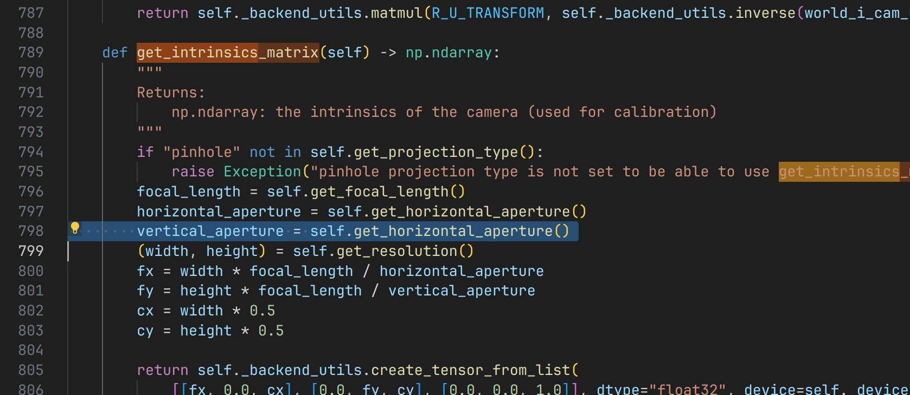

# Frequently Asked Questions

## I Can't Find the Docs !!!

Isaac Sim is under active development, whose latest documentation could change. As a result, links you find on search engines may only belong to an older version of documentation, which causes a 404 error.

Our recommondendation is to always start from [this main page](https://docs.omniverse.nvidia.com/isaacsim/latest/index.html) for the latest version of the documentation, and use the built-in searching. Here are some portals:

## Camera Intrinsics Error

In Isaac Sim 2022.2.1, the built-in camera API for computing the intrinsics matrix has a bug:

You can fix it in `~/.local/share/ov/pkg/isaac_sim-2022.2.1/exts/omni.isaac.sensor/omni/isaac/sensor/scripts/camera.py` by changing `get_horizontal_aperture` to `get_vertical_aperture`.

## Surface Gripper Bug
In Isaac Sim 2022.2.0, and Isaac Sim 2022.2.1 the built-in surface gripper will crash the simulation if attemping to grasp the grondplane or other robots. You can have a workaround as described in this [thread](https://forums.developer.nvidia.com/t/surface-gripper-bug/231407/8). 

## Reacheable space for robots
If using the default RMPflow motion generation to contorl robots, the reachable space do not match the reachable space in the URDF. It actaully uses a simplifed collision file. Therefore, if attemping to fully utilize the reachable space, there is a need to modify the collision file as in this [thread](https://forums.developer.nvidia.com/t/end-effector-offset-of-rmp-ik/228158/11)