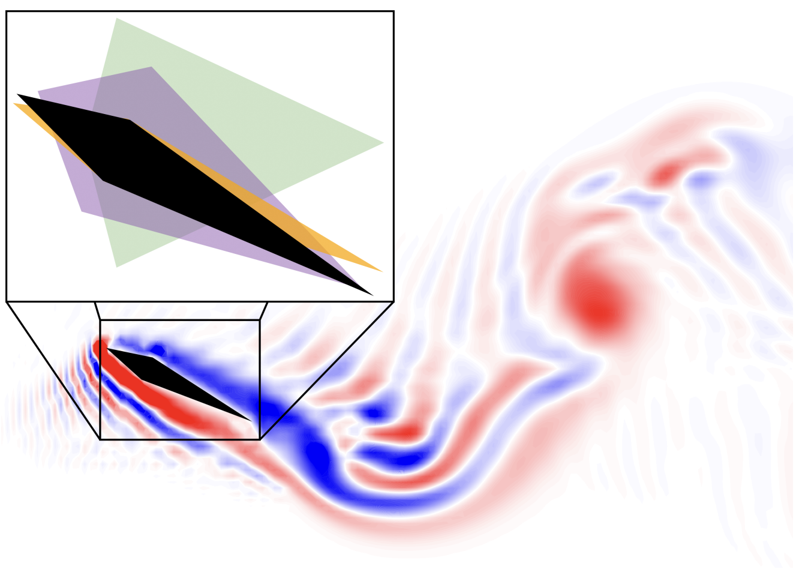

# Fluid Simulator

## FluidLab

 
Information about FluidLab

<h2 align="center">
  <b>FluidLab</b>

    <a href="https://fluidlab2023.github.io/" target="_blank"></img></a>
    &nbsp;
    <a href="https://arxiv.org/abs/2303.02346" target="_blank"></img></a>
    &nbsp;
    <a href="https://github.com/zhouxian/FluidLab" target="_blank"></img></a>

</h2>

<video width="800" height="600" controls>
  <source src="https://fluidlab2023.github.io/static/videos/tasks.m4v" type="video/mp4"></source>
</video>

> FluidLab is a differentiable environment with a set of complex fluid manipulation tasks. FluidLab is powered by FluidEngine, a fully differentiable and multi-material physics engine, supporting rigid, elastic, plastic materials, inviscid and viscous liquid, and gaseous phenomena such as smoke.

## Flex

 
Information about Flex

<h2 align="center">
  <b>Flex</b>

    <a href="https://developer.nvidia.com/flex" target="_blank"></img></a>
    &nbsp;
    <a href="https://github.com/NVIDIAGameWorks/FleX" target="_blank"></img></a>

</h2>

    
  

> FleX is a particle based simulation technique for real-time visual effects.Traditionally, visual effects are made using a combination of elements created using specialized solvers for rigid bodies, fluids, clothing, etc. Because FleX uses a unified particle representation for all object types, it enables new effects where different simulated substances can interact with each other seamlessly. Such unified physics solvers are a staple of the offline computer graphics world, where tools such as Autodesk Maya's nCloth, and Softimage's Lagoa are widely used. The goal for FleX is to use the power of GPUs to bring the capabilities of these offline applications to real-time computer graphics.

## Aquarium 

 
Information about Aquarium

<h2 align="center">
  <b>Aquarium</b>

    <a href="https://rexlab.ri.cmu.edu/papers/aquarium.pdf" target="_blank"></img></a>

</h2>

<!-- 

    
  

 -->

>  Aquarium, a differentiable fluid structure interaction solver for robotics that offers stable simulation, accurately coupled fluid-robot physics in two dimensions, and full differentiability with respect to fluid and robot states and parameters. Aquarium achieves stable simulation with accurate flow physics by directly integrating over the incompressible Navier-Stokes equations using a fully implicit Crank-Nicolson scheme with a second-order finite-volume spatial discretization. The fluid and robot physics are coupled using the immersed-boundary method by formulating the no slip condition as an equality constraint applied directly to the Navier-Stokes system. This choice of coupling allows the fluid structure interaction to be posed and solved as a nonlinear optimization problem. This optimization-based formulation is then exploited using the implicit-function theorem to compute derivatives.

