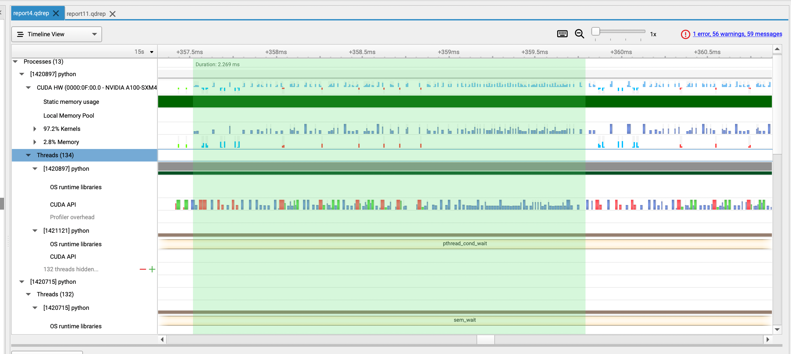

# Articulation
> Articulated objects and robots are always described using XML files.  URDF(Unified Robot Description Format) is the most popular one used in robotics for describing the structure and properties of a robot. Here we provide code for articulation parsing, calculation and so on.

### Query a Link from URDF file
To query a link in a URDF file, we provide code using urdfpy and xml parser.
- urdfpy
    ```python
    from urdfpy import URDF
    # Load URDF file
    robot = URDF.load('path_to_urdf_file.urdf')

    # Query a link by name
    link_name = 'desired_link_name'
    link = robot.link_map[link_name]

    # Access link properties
    print(f"Link name: {link.name}")
    print(f"Link inertia: {link.inertia}")
    ```
- xml
    ```python
    import xml.etree.ElementTree as ET

    # Load and parse the URDF file
    tree = ET.parse('path_to_urdf_file.urdf')
    root = tree.getroot()

    # Query a link by name
    link_name = 'desired_link_name'
    link = root.find(f".//link[@name='{link_name}']")

    if link is not None:
        print(f"Found link: {link.get('name')}")
    else:
        print("Link not found")
    ```
### Query a Joint from URDF file
To query a joint in a URDF file, we provide code using urdfpy and xml parser.
- urdfpy
  ```python
  from urdfpy import URDF

    # Load URDF file
    robot = URDF.load('path_to_urdf_file.urdf')

    # Query a joint by name
    joint_name = 'desired_joint_name'
    joint = robot.joint_map[joint_name]

    # Access joint properties
    print(f"Joint name: {joint.name}")
    print(f"Joint type: {joint.joint_type}")
  ```
- xml
    ```python
    import xml.etree.ElementTree as ET

    # Load and parse the URDF file
    tree = ET.parse('path_to_urdf_file.urdf')
    root = tree.getroot()

    # Query a joint by name
    joint_name = 'desired_joint_name'
    joint = root.find(f".//joint[@name='{joint_name}']")

    if joint is not None:
        print(f"Found joint: {joint.get('name')}")
    else:
        print("Joint not found")
    ```

### Merging URDF Geometries to OBJ
To merge URDF geometries to an OBJ file, we provide code using xml parser. This code still needs testing.
```python
    import xml.etree.ElementTree as ET
    import trimesh
    import numpy as np

    def parse_origin(element):
        """Parse the origin XML element to extract position and rotation."""
        if element is None:
            return np.eye(4)  # Return identity matrix if no origin is specified
        xyz = element.get('xyz', '0 0 0').split()
        rpy = element.get('rpy', '0 0 0').split()
        xyz = [float(val) for val in xyz]
        rpy = [float(val) for val in rpy]

        # Compute the transformation matrix from position and rotation (roll, pitch, yaw)
        translation_matrix = trimesh.transformations.translation_matrix(xyz)
        rotation_matrix = trimesh.transformations.euler_matrix(*rpy)
        return trimesh.transformations.concatenate_matrices(translation_matrix, rotation_matrix)

    # Load and parse the URDF file
    tree = ET.parse('path_to_urdf_file.urdf')
    root = tree.getroot()

    # Initialize an empty scene
    scene = trimesh.Scene()

    # Iterate through each link and process its geometry
    for link in root.findall('link'):
        for visual in link.findall('visual'):
            origin = visual.find('origin')
            transform = parse_origin(origin)
            geometry = visual.find('geometry')
            mesh_element = geometry.find('mesh')
            if mesh_element is not None:
                mesh_filename = mesh_element.get('filename')
                # Load the mesh and apply transformation
                loaded_mesh = trimesh.load(mesh_filename)
                loaded_mesh.apply_transform(transform)
                scene.add_geometry(loaded_mesh)

    # Export the scene to an OBJ file
    scene.export('output.obj')
```

### Batch-Processed URDF Forward Kinematics

To facilitate batch processing of URDF forward kinematics, we present the code for the HandModel class, which is primarily derived from a modified version of [pytorch_kinematics](https://github.com/tengyu-liu/GenDexGrasp/tree/main/thirdparty/pytorch_kinematics).

We offer a straightforward example showcasing the utilization of the HandModel class to derive the Forward Kinematics (FK) merged mesh of the ShadowHand robot. You can find the demo required asset from [shadow-robot](https://github.com/shadow-robot/simox_ros/tree/master/sr_grasp_description).

<details> <summary>class.HandModel for batch FK</summary>

```python
import os
import torch
import numpy as np

import trimesh as tm
import trimesh.sample
import transforms3d
import pytorch_kinematics as pk
from pytorch_kinematics.urdf_parser_py.urdf import (URDF, Box, Cylinder, Mesh, Sphere)
import urdf_parser_py.urdf as URDF_PARSER


class HandModel:
    def __init__(self, robot_name, urdf_filename, mesh_path,
                 batch_size=1, 
                 device=torch.device('cuda' if torch.cuda.is_available() else 'cpu'),
                 mesh_nsp=128,
                 hand_scale=1.
                 ):
        self.device = device
        self.robot_name = robot_name
        self.batch_size = batch_size
        self.mesh_nsp = mesh_nsp
        # prepare model
        self.robot = pk.build_chain_from_urdf(open(urdf_filename).read()).to(dtype=torch.float, device=self.device)
        self.robot_full = URDF_PARSER.URDF.from_xml_file(urdf_filename)
        self.global_translation = None
        self.global_rotation = None
        # prepare surface point samples
        self.surface_points = {}
        self.surface_points_normal = {}
        visual = URDF.from_xml_string(open(urdf_filename).read())
        self.mesh_verts = {}
        self.mesh_faces = {}
        
        self.canon_verts = []
        self.canon_faces = []
        self.idx_vert_faces = []
        self.face_normals = []
            
        for i_link, link in enumerate(visual.links):
            print(f"Processing link #{i_link}: {link.name}")
            # load mesh
            if len(link.visuals) == 0:
                continue
            if type(link.visuals[0].geometry) == Mesh:
                # print(link.visuals[0])
                if robot_name == 'shadowhand':
                    filename = link.visuals[0].geometry.filename.split('/')[-1]
                else:
                    raise NotImplementedError
                mesh = tm.load(os.path.join(mesh_path, filename), force='mesh', process=False)
            elif type(link.visuals[0].geometry) == Cylinder:
                mesh = tm.primitives.Cylinder(
                    radius=link.visuals[0].geometry.radius, height=link.visuals[0].geometry.length)
            elif type(link.visuals[0].geometry) == Box:
                mesh = tm.primitives.Box(extents=link.visuals[0].geometry.size)
            elif type(link.visuals[0].geometry) == Sphere:
                mesh = tm.primitives.Sphere(
                    radius=link.visuals[0].geometry.radius)
            else:
                print(type(link.visuals[0].geometry))
                raise NotImplementedError
            try:
                scale = np.array(
                    link.visuals[0].geometry.scale).reshape([1, 3])
            except:
                scale = np.array([[1, 1, 1]])
            try:
                rotation = transforms3d.euler.euler2mat(*link.visuals[0].origin.rpy)
                translation = np.reshape(link.visuals[0].origin.xyz, [1, 3])
            except AttributeError:
                rotation = transforms3d.euler.euler2mat(0, 0, 0)
                translation = np.array([[0, 0, 0]])
                
            # Surface point
            # mesh.sample(int(mesh.area * 100000)) * scale
            if self.robot_name == 'shadowhand':
                pts, pts_face_index = trimesh.sample.sample_surface(mesh=mesh, count=self.mesh_nsp)
                pts_normal = np.array([mesh.face_normals[x] for x in pts_face_index], dtype=float)
            else:
                raise NotImplementedError
            pts *= scale

            if robot_name == 'shadowhand':
                pts = pts[:, [0, 2, 1]]
                pts_normal = pts_normal[:, [0, 2, 1]]
                pts[:, 1] *= -1
                pts_normal[:, 1] *= -1

            pts = np.matmul(rotation, pts.T).T + translation
            pts = np.concatenate([pts, np.ones([len(pts), 1])], axis=-1)
            pts_normal = np.concatenate([pts_normal, np.ones([len(pts_normal), 1])], axis=-1)
            self.surface_points[link.name] = torch.from_numpy(pts).to(
                device).float().unsqueeze(0).repeat(batch_size, 1, 1)
            self.surface_points_normal[link.name] = torch.from_numpy(pts_normal).to(
                device).float().unsqueeze(0).repeat(batch_size, 1, 1)

            # visualization mesh
            self.mesh_verts[link.name] = np.array(mesh.vertices) * scale
            if robot_name == 'shadowhand':
                self.mesh_verts[link.name] = self.mesh_verts[link.name][:, [0, 2, 1]]
                self.mesh_verts[link.name][:, 1] *= -1
            self.mesh_verts[link.name] = np.matmul(rotation, self.mesh_verts[link.name].T).T + translation
            self.mesh_faces[link.name] = np.array(mesh.faces)

        self.revolute_joints = []
        for i in range(len(self.robot_full.joints)):
            if self.robot_full.joints[i].joint_type == 'revolute':
                self.revolute_joints.append(self.robot_full.joints[i])
        self.revolute_joints_q_mid = []
        self.revolute_joints_q_var = []
        self.revolute_joints_q_upper = []
        self.revolute_joints_q_lower = []
        for i in range(len(self.robot.get_joint_parameter_names())):
            for j in range(len(self.revolute_joints)):
                if self.revolute_joints[j].name == self.robot.get_joint_parameter_names()[i]:
                    joint = self.revolute_joints[j]
            assert joint.name == self.robot.get_joint_parameter_names()[i]
            self.revolute_joints_q_mid.append(
                (joint.limit.lower + joint.limit.upper) / 2)
            self.revolute_joints_q_var.append(
                ((joint.limit.upper - joint.limit.lower) / 2) ** 2)
            self.revolute_joints_q_lower.append(joint.limit.lower)
            self.revolute_joints_q_upper.append(joint.limit.upper)

        self.revolute_joints_q_lower = torch.Tensor(self.revolute_joints_q_lower).repeat([self.batch_size, 1]).to(device)
        self.revolute_joints_q_upper = torch.Tensor(self.revolute_joints_q_upper).repeat([self.batch_size, 1]).to(device)

        self.current_status = None
        self.scale = hand_scale
    
    @staticmethod
    def _rotation_matrix_from_rpy(rpy_batch):
        # Convert batched rpy to rotation matrices using PyTorch
        roll, pitch, yaw = torch.unbind(rpy_batch, dim=-1)
        
        cos_r, sin_r = torch.cos(roll), torch.sin(roll)
        cos_p, sin_p = torch.cos(pitch), torch.sin(pitch)
        cos_y, sin_y = torch.cos(yaw), torch.sin(yaw)
        
        r11 = cos_y * cos_p
        r12 = cos_y * sin_p * sin_r - sin_y * cos_r
        r13 = cos_y * sin_p * cos_r + sin_y * sin_r
        
        r21 = sin_y * cos_p
        r22 = sin_y * sin_p * sin_r + cos_y * cos_r
        r23 = sin_y * sin_p * cos_r - cos_y * sin_r
        
        r31 = -sin_p
        r32 = cos_p * sin_r
        r33 = cos_p * cos_r
        
        rotation_matrix = torch.stack([r11, r12, r13, r21, r22, r23, r31, r32, r33], dim=-1)
        rotation_matrix = rotation_matrix.view(*rpy_batch.shape[:-1], 3, 3)
        
        return rotation_matrix

    def update_kinematics(self, q):
        self.global_translation = q[:, :3]
        self.global_rotation = self._rotation_matrix_from_rpy(q[:, 3:6])
        self.current_status = self.robot.forward_kinematics(q[:, 6:])

    def get_surface_points(self, q=None):
        if q is not None:
            self.update_kinematics(q)
        surface_points = []

        for link_name in self.surface_points:
        # for link_name in parts:
            # get transformation
            trans_matrix = self.current_status[link_name].get_matrix()
            surface_points.append(torch.matmul(trans_matrix, self.surface_points[link_name].transpose(1, 2)).transpose(1, 2)[..., :3])
        surface_points = torch.cat(surface_points, 1)
        surface_points = torch.matmul(self.global_rotation, surface_points.transpose(1, 2)).transpose(1, 2) + self.global_translation.unsqueeze(1)
        return surface_points * self.scale

    def get_surface_points_and_normals(self, q=None):
        if q is not None:
            self.update_kinematics(q=q)
        surface_points = []
        surface_normals = []

        for link_name in self.surface_points:
            # for link_name in parts:
            # get transformation
            trans_matrix = self.current_status[link_name].get_matrix()
            surface_points.append(torch.matmul(trans_matrix, self.surface_points[link_name].transpose(1, 2)).transpose(1, 2)[..., :3])
            surface_normals.append(torch.matmul(trans_matrix, self.surface_points_normal[link_name].transpose(1, 2)).transpose(1, 2)[..., :3])
        surface_points = torch.cat(surface_points, 1)
        surface_normals = torch.cat(surface_normals, 1)
        surface_points = torch.matmul(self.global_rotation, surface_points.transpose(1, 2)).transpose(1, 2) + self.global_translation.unsqueeze(1)
        surface_normals = torch.matmul(self.global_rotation, surface_normals.transpose(1, 2)).transpose(1, 2)

        return surface_points * self.scale, surface_normals

    def get_meshes_from_q(self, q=None, i=0):
        meshes = []
        if q is not None: self.update_kinematics(q)
        for idx, link_name in enumerate(self.mesh_verts):
            trans_matrix = self.current_status[link_name].get_matrix()
            trans_matrix = trans_matrix[min(len(trans_matrix) - 1, i)].detach().cpu().numpy()
            v = self.mesh_verts[link_name]
            transformed_v = np.concatenate([v, np.ones([len(v), 1])], axis=-1)
            transformed_v = np.matmul(trans_matrix, transformed_v.T).T[..., :3]
            transformed_v = np.matmul(self.global_rotation[i].detach().cpu().numpy(),
                                      transformed_v.T).T + np.expand_dims(
                self.global_translation[i].detach().cpu().numpy(), 0)
            transformed_v = transformed_v * self.scale
            f = self.mesh_faces[link_name]
            meshes.append(tm.Trimesh(vertices=transformed_v, faces=f))
        return meshes

if __name__ == '__main__':
    seed = 42
    np.random.seed(seed)

    batchsize = 4
    device = torch.device('cuda' if torch.cuda.is_available() else 'cpu')
    hand_model = HandModel(robot_name='shadowhand', 
                           urdf_filename='assets/sr_grasp_description/urdf/shadowhand.urdf', 
                           mesh_path='assets/sr_grasp_description/meshes',
                           batch_size=batchsize, device=device, hand_scale=1.0)
    print(len(hand_model.robot.get_joint_parameter_names()))

    joint_lower = np.array(hand_model.revolute_joints_q_lower.cpu().reshape(batchsize, -1))
    joint_upper = np.array(hand_model.revolute_joints_q_upper.cpu().reshape(batchsize, -1))
    joint_mid = (joint_lower + joint_upper) / 2
    joints_q = joint_mid
    q = torch.concatenate([torch.zeros([batchsize, 6], device=device), torch.from_numpy(joints_q).to(device)], dim=-1)
    # hand_model.get_surface_points(q)
    hand_model.get_surface_points(q)
    meshes = hand_model.get_meshes_from_q(q)
    meshes = tm.util.concatenate(meshes)
    meshes.show()

```

</details>

### Speed Things Up with Hand-Written FK

While the pytorch_kinematics package provides a user-friendly method for executing batched forward kinematics, its current implementation exhibits inefficiencies. For instance, when converting a joint angle to the joint rotation of a revolute joint, it initially translates the axis-angle representation to quaternions. Following this step, it constructs a `pytorch_kinematics.transforms.Transforms3d` object, which subsequently converts the quaternions into rotation matrices.

<details> <summary>class.Frame for converting joint angle to joint rotation</summary>

```python
    def get_transform(self, theta):
        dtype = self.joint.axis.dtype
        d = self.joint.axis.device
        if self.joint.joint_type == 'revolute':
            t = tf.Transform3d(rot=tf.axis_angle_to_quaternion(theta * self.joint.axis), dtype=dtype, device=d)  # this line converts theta to quaternions then to rotation matrix
        elif self.joint.joint_type == 'prismatic':
            t = tf.Transform3d(pos=theta * self.joint.axis, dtype=dtype, device=d)
        elif self.joint.joint_type == 'fixed':
            t = tf.Transform3d(default_batch_size=theta.shape[0], dtype=dtype, device=d)
        else:
            raise ValueError("Unsupported joint type %s." % self.joint.joint_type)
        return self.joint.offset.compose(t)
```

</details>

Furthermore, the handling of transformation composition within `pk` is inappropriate, leading to increased computational complexity. When composing multiple `Transforms3d` objects, `pk` stores all these objects in a list and multiplies them successively upon calling `get_matrix`. Consequently, for the nth joint on a kinematic chain, `pk` performs `2*n` matrix multiplications when invoking `get_matrix`, whereas it could achieve the same outcome with only 2 matrix multiplications by reusing the composed transformation matrix from the preceding joint.

<details> <summary>class.Transforms3d for transformation composition</summary>

```python
    def compose(self, *others):
        """
        Return a new Transform3d with the tranforms to compose stored as
        an internal list.

        Args:
            *others: Any number of Transform3d objects

        Returns:
            A new Transform3d with the stored transforms
        """
        out = Transform3d(device=self.device, dtype=self.dtype)
        out._matrix = self._matrix.clone()
        for other in others:
            if not isinstance(other, Transform3d):
                msg = "Only possible to compose Transform3d objects; got %s"
                raise ValueError(msg % type(other))
        out._transforms = self._transforms + list(others)
        return out
            return out

    def get_matrix(self):
        """
        Return a matrix which is the result of composing this transform
        with others stored in self.transforms. Where necessary transforms
        are broadcast against each other.
        For example, if self.transforms contains transforms t1, t2, and t3, and
        given a set of points x, the following should be true:

        .. code-block:: python

            y1 = t1.compose(t2, t3).transform(x)
            y2 = t3.transform(t2.transform(t1.transform(x)))
            y1.get_matrix() == y2.get_matrix()

        Returns:
            A transformation matrix representing the composed inputs.
        """
        composed_matrix = self._matrix.clone()
        if len(self._transforms) > 0:
            for other in self._transforms:
                other_matrix = other.get_matrix()
                composed_matrix = _broadcast_bmm(composed_matrix, other_matrix)
        return composed_matrix
```

</details>

Additionally, `pk` employs multiple layers of encapsulation, resulting in overhead, particularly when all the code is composed in Python. While attempting to accelerate batched forward kinematics (FK) using GPU, `pk` generates a sequence of small CUDA kernels interspersed with gaps to dispatch these kernels and advance the Python code. In cases where gradients are necessary during FK, this process is reiterated during the backward pass. As forward kinematics necessitates sequential computation, this overhead becomes notably severe, potentially evolving into the primary bottleneck during the entire training or optimization iteration.



To mitigate these inefficiencies, it's recommended to integrating forward kinematics directly within the `class.HandModel`. Optimize by directly converting axis angles to rotation matrices. But avoid using `pytorch3d.transforms.axis_angle_to_matrix` since it also uses quaternions as an inefficient intermediate. Additionally, be sure to reuse the translation and rotation from the parent joint. The rest is straightforward. 

<details> <summary>optimized update_kinematics method for class.HandModel</summary>

```python
    def update_kinematics(self, hand_pose):
        self.hand_pose = hand_pose
        if self.hand_pose.requires_grad:
            self.hand_pose.retain_grad()
        self.global_translation = self.hand_pose[:, 0:3]
        self.global_rotation = robust_compute_rotation_matrix_from_ortho6d(self.hand_pose[:, 3:9])
        batch_size = len(self.hand_pose)
        self.local_translations = {}
        self.local_rotations = {}
        self.local_translations[self.joints_parent[0]] = torch.zeros([batch_size, 3], dtype=torch.float, device=self.device)
        self.local_rotations[self.joints_parent[0]] = torch.eye(3, dtype=torch.float, device=self.device).expand(batch_size, 3, 3).contiguous()
        for joint_name, j in self.joint_order.items():
            i = self.joint_names.index(joint_name)
            child_name = self.joints_child[i]
            parent_name = self.joints_parent[i]
            # reuse parent joint's results
            translations = self.local_rotations[parent_name] @ self.joints_translation[i] + self.local_translations[parent_name]
            rotations = self.local_rotations[parent_name] @ self.joints_rotation[i]
            if self.joints_type[i] == 'revolute':
                thetas = self.hand_pose[:, 9 + j].view(batch_size, 1, 1)
                K = self.joints_axis_K[i]
                joint_rotations = torch.eye(3, dtype=torch.float, device=self.device) + torch.sin(thetas) * K + (1 - torch.cos(thetas)) * (K @ K)  # axis-angles to rotation matrices
                rotations = rotations @ joint_rotations
            self.local_translations[child_name] = translations
            self.local_rotations[child_name] = rotations
```

</details>
