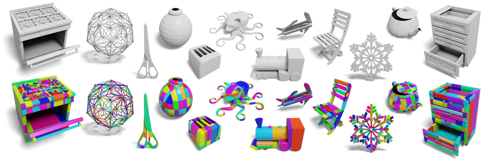

# Convex Decomposition

> **Tutorial for convex decomposition for physical simulation and toolkits for doing that**

### What is convex decomposition?

Convex decomposition involves breaking down complex, non-convex shape into multiple simpler, convex shapes.
Here is an example from CoACD[^1]  showing the original geometry and its corresponding convex decomposition, with each
color represent a
separate convex mesh.

### Why we care about convex decomposition when using simulator?

In simulation, collision detection determines when objects intersect or come into contact.
This is particularly important in physical simulations where interactions
between objects need to be realistically modeled, such as the contact between object and gripper in robot manipulation
and the contact between leg and ground in locomotion of a robot dog.

Collision detection algorithms typically involve two phases: the broad phase and the narrow phase. The broad phase
identifies pairs of objects that might be colliding, while the narrow phase accurately calculates whether a collision
has occurred and provides additional information like contact points and collision normals. In physics engines,
collision detection can take from 10% to 50% of the total computation time, depending on the
complexity of the object geometry.

Using convex meshes to represent geometry can accelerate the narrow phase of collision detection, enhancing
the overall performance of a physical simulation. Moreover, many simulators automatically convert your imported mesh
into a convex hull by default. If convex decomposition isn't performed beforehand, the simulation results might not be
as expected. A classic example is a "closed mug" which cannot be used to hold water in the simulation.

[^1]: SIGGRAPH2022: Approximate convex decomposition for 3d meshes with collision-aware concavity and tree search.
