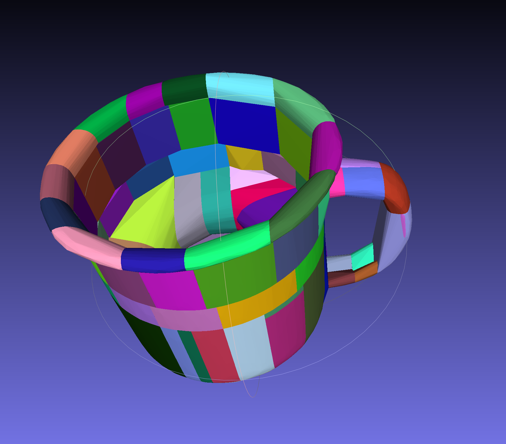

# Convex Decomposition

> **Tutorial for convex decomposition for physical simulation and toolkits for doing that**

### What is convex decomposition?

Convex decomposition involves breaking down complex, non-convex shape into multiple simpler, convex shapes.
Here is an example from CoACD[^1]  showing the original geometry and its corresponding convex decomposition, with each
color represent a
separate convex mesh.


### Why we care about convex decomposition when using simulator?

In simulation, collision detection determines when objects intersect or come into contact.
This is particularly important in physical simulations where interactions
between objects need to be realistically modeled, such as the contact between object and gripper in robot manipulation
and the contact between leg and ground in locomotion of a robot dog.

Collision detection algorithms typically involve two phases: the broad phase and the narrow phase. The broad phase
identifies pairs of objects that might be colliding, while the narrow phase accurately calculates whether a collision
has occurred and provides additional information like contact points and collision normals. In physics engines,
collision detection can take from 10% to 50% of the total computation time, depending on the
complexity of the object geometry.

Using convex meshes to represent geometry can accelerate the narrow phase of collision detection, by simplifying the
collision detection process, resulting in faster collision detection algorithms compared to the algorithm handling
non-convex meshes.
Thus, it can enhance the overall performance of physical simulation.
Moreover, many simulators automatically **convert your imported mesh into a convex hull by default** (*middle sub-figure
below*). If convex decomposition isn't performed beforehand, the simulation
results might not be as expected. A classic example is a "closed mug" which cannot be used to hold water in the
simulation.


## Using default convex decomposition algorithm in simulator

Many simulation platforms come integrated with a convex decomposition algorithm that is accessible directly through the
simulator's API. For instance, IsaacGym and PyBullet have an in-built implementation of
the [V-HACD](https://github.com/kmammou/v-hacd) algorithm, while
SAPIEN includes the [CoCAD](https://github.com/SarahWeiii/CoACD) algorithm. However, these algorithms are typically
disabled by default. Therefore, you might need to enable them and tune the decomposition parameters if the default
settings do not yield the desired results.

### IsaacGym

You can enable v-hacd when loading asset.

```python
asset_options = gymapi.AssetOptions()
asset_options.vhacd_enabled = True
asset_options.vhacd_params.resolution = 1e6
```

Full list of tunable parameters in IsaacGym:

```python
class VhacdParams:
  alpha: float
  beta: float
  concavity: float
  convex_hull_approximation: bool
  convex_hull_downsampling: int
  max_convex_hulls: int
  max_num_vertices_per_ch: int
  min_volume_per_ch: float
  mode: 0
  ocl_acceleration: bool
  pca: int
  plane_downsampling: int
  project_hull_vertices: bool
  resolution: int
```

### SAPIEN

When loading URDF, e.g. cabinet or robot:

```python
loader = scene.create_urdf_loader()
loader.multiple_collisions_decomposition = "coacd"
loader.multiple_collisions_decomposition_params = {}
```

When loading single link object, e.g. mug:

```python
builder = scene.create_actor_builder()
builder = builder.add_multiple_convex_collisions_from_file(
  filename=YOUR_MESH_FILE_PATH,
  decomposition="coacd",
  decomposition_params=dict(
    threshold=0.05,
    preprocess_mode="off",
  ),
)
builder.add_visual_from_file(filename=YOUR_MESH_FILE_PATH)
single_link_object = builder.build()
```

Full list of CoACD parameters and its default:

```python
threshold = 0.05,
max_convex_hull = -1,
preprocess_mode = "auto",
preprocess_resolution = 30,
resolution = 2000,
mcts_nodes = 20,
mcts_iterations = 150,
mcts_max_depth = 3,
pca = False,
merge = True,
seed = 0,
verbose = False,
```

### PyBullet

Unlike IsaacGym and SAPIEN, PyBullet segregates the process of convex decomposition and object loading into two separate
steps. First, you can perform the convex decomposition and save the result to your filesystem. Following this, you
can load the decomposed mesh into the simulation using [PyBullet's loader function](../3_snippets/pybullet/loading.md).

```python
import pybullet as p

YOUR_MESH_FILE_PATH = "in.obj"
YOUR_CONVEX_MESH_SAVE_PATH = "out_convex.obj"
p.connect(p.DIRECT)
p.vhacd(YOUR_MESH_FILE_PATH, YOUR_CONVEX_MESH_SAVE_PATH, "log.txt", resolution=1e6)
```

## Standalone convex decomposition

For highly complex geometries, the default parameters of these convex decomposition algorithms may not yield
satisfactory results. As such, you might need to adjust the decomposition parameters extensively. In such a scenario,
rerunning simulation code each time can be laborious. A more efficient approach is to perform decomposition outside the
simulator, evaluate the performance, and once satisfied, import the final output into the simulator.
For instance, you can use CoACD in a standalone manner:

```bash
pip install coacd

coacd -i INPUT_MESH.obj -o OUTPUT_MESH.obj -t 0.1
```

You can use [MessLab](https://www.meshlab.net/) to visualize the results of convex decomposition:



Please note that this command will store multiple convex meshes in a single `.obj` file. As a result, when using this
convex mesh, you must explicitly inform your simulator that it contains multiple meshes. Failing to do so will cause
your `.obj` file to be interpreted as a single mesh, which negates the purpose of performing convex
decomposition.

```python
# In IsaacGym
asset_options = gymapi.AssetOptions()
asset_options.convex_decomposition_from_submeshes = True

# In SAPIEN
loader = scene.create_urdf_loader()
loader.load_multiple_collisions_from_file = True

```

[^1]: SIGGRAPH2022: Approximate convex decomposition for 3d meshes with collision-aware concavity and tree search.
