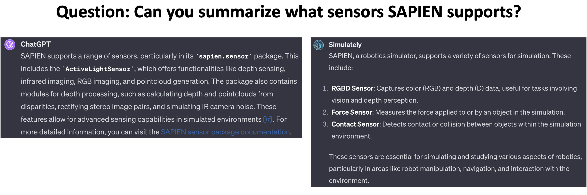

## 2024-04-04

### Uncertainty-aware Active Learning of NeRF-based Object Models for Robot Manipulators using Visual and Re-orientation Actions

- **Authors**: Saptarshi Dasgupta, Akshat Gupta, Shreshth Tuli, Rohan Paul
- **Tags**: `Review`, `Imitation Learning`

#### Abstract

Manipulating unseen objects is challenging without a 3D representation, as objects generally have occluded surfaces. This requires physical interaction with objects to build their internal representations. This paper presents an approach that enables a robot to rapidly learn the complete 3D model of a given object for manipulation in unfamiliar orientations. We use an ensemble of partially constructed NeRF models to quantify model uncertainty to determine the next action (a visual or re-orientation action) by optimizing informativeness and feasibility. Further, our approach determines when and how to grasp and re-orient an object given its partial NeRF model and re-estimates the object pose to rectify misalignments introduced during the interaction. Experiments with a simulated Franka Emika Robot Manipulator operating in a tabletop environment with benchmark objects demonstrate an improvement of (i) 14% in visual reconstruction quality (PSNR), (ii) 20% in the geometric/depth reconstruction of the object surface (F-score) and (iii) 71% in the task success rate of manipulating objects a-priori unseen orientations/stable configurations in the scene; over current methods. The project page can be found here: this https URL.

[Paper Link](https://arxiv.org/abs/2404.01812)

## 2024-04-03

### Fusion Dynamical Systems with Machine Learning in Imitation Learning: A Comprehensive Overview

- **Authors**: Yingbai Hu, Fares J. Abu-Dakka, Fei Chen, Xiao Luo, Zheng Li, Alois Knoll, Weiping Ding
- **Institutions**: Chinese University of Hong Kong, Technical University of Munich
- **Tags**: `Review`, `Imitation Learning`

#### Abstract

Imitation Learning (IL), also referred to as Learning from Demonstration (LfD), holds significant promise for capturing expert motor skills through efficient imitation, facilitating adept navigation of complex scenarios. A persistent challenge in IL lies in extending generalization from historical demonstrations, enabling the acquisition of new skills without re-teaching. Dynamical system-based IL (DSIL) emerges as a significant subset of IL methodologies, offering the ability to learn trajectories via movement primitives and policy learning based on experiential abstraction. This paper emphasizes the fusion of theoretical paradigms, integrating control theory principles inherent in dynamical systems into IL. This integration notably enhances robustness, adaptability, and convergence in the face of novel scenarios. This survey aims to present a comprehensive overview of DSIL methods, spanning from classical approaches to recent advanced approaches. We categorize DSIL into autonomous dynamical systems and non-autonomous dynamical systems, surveying traditional IL methods with low-dimensional input and advanced deep IL methods with high-dimensional input. Additionally, we present and analyze three main stability methods for IL: Lyapunov stability, contraction theory, and diffeomorphism mapping. Our exploration also extends to popular policy improvement methods for DSIL, encompassing reinforcement learning, deep reinforcement learning, and evolutionary strategies.

[Paper Link](https://arxiv.org/abs/2403.19916)

### Learning Visual Quadrupedal Loco-Manipulation from Demonstrations

- **Authors**: Zhengmao He, Kun Lei, Yanjie Ze, Koushil Sreenath, Zhongyu Li, Huazhe Xu
- **Institutions**: Shanghai Qizhi Institute, Hong Kong University of Science and Technology, Carnegie Mellon University, IIIS, Tsinghua University
- **Tags**: `Reinforcement Learning`, `Behavioral Cloning`, `Mobile Manipulation`

#### Abstract

Quadruped robots are progressively being integrated into human environments. Despite the growing locomotion capabilities of quadrupedal robots, their interaction with objects in realistic scenes is still limited. While additional robotic arms on quadrupedal robots enable manipulating objects, they are sometimes redundant given that a quadruped robot is essentially a mobile unit equipped with four limbs, each possessing 3 degrees of freedom (DoFs). Hence, we aim to empower a quadruped robot to execute real-world manipulation tasks using only its legs. We decompose the loco-manipulation process into a low-level reinforcement learning (RL)-based controller and a high-level Behavior Cloning (BC)-based planner. By parameterizing the manipulation trajectory, we synchronize the efforts of the upper and lower layers, thereby leveraging the advantages of both RL and BC. Our approach is validated through simulations and real-world experiments, demonstrating the robot's ability to perform tasks that demand mobility and high precision, such as lifting a basket from the ground while moving, closing a dishwasher, pressing a button, and pushing a door. Project website: this https URL

[Paper Link](https://arxiv.org/abs/2403.20328)

[Website Link](https://zhengmaohe.github.io/leg-manip)

#### Notes

These are the notes.
