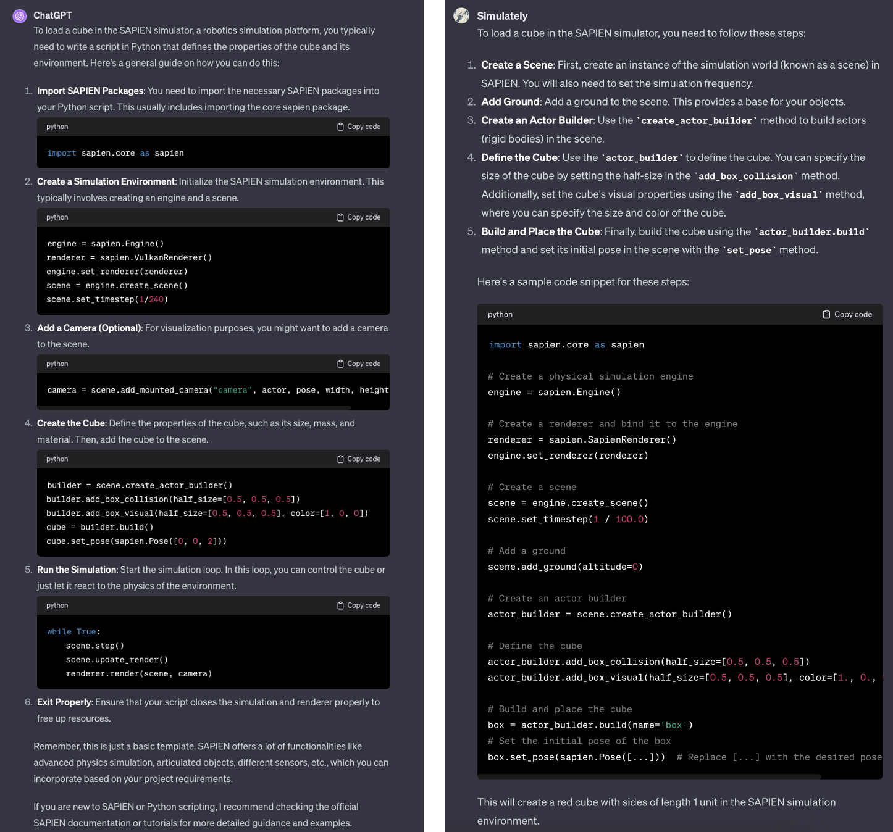

# Try our Simulately GPT Now
Try our Simulately GPT [here](https://chat.openai.com/g/g-cjN7iYpRZ-simulately). You can ask anything about Simulators, Robotics and Vision.

# About Simulately GPT
Our Simulately GPT is built upon [OpenAI's ChatGPT](https://chat.openai.com). We provide initial prompt and related knowledge to the model, and it will generate the response as an expert in Simulator and Robotics.
It is powered by [OpenAI's ChatGPT](https://chat.openai.com).

## Demo

Here we provide several demos of our Simulately GPT. You can try it [here](https://chat.openai.com/g/g-cjN7iYpRZ-simulately).

- Here is a comparison of GPT-4 and our Simulately GPT. Our Simulately GPT provides executable code and accurate answers, while GPT-4 provides outdated information.
